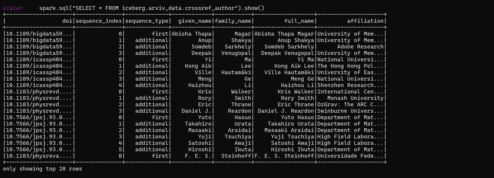

# Description

This document provides examples and guidance for downstream data users (such as **data analysts and data scientists**) to perform data analysis demos using Spark SQL on the output of the data pipeline.

---

1. Close unnecessary Docker services

    ```bash
    # Stop Airflow and Kafka related Docker services to free up resources
    docker stop airflow-webserver airflow-worker airflow-scheduler kafka-schema-registry kafka zookeeper arxiv-data-pipeline-kafka-consumer1-1 arxiv-data-pipeline-kafka-consumer2-1 kafka-connect airflow-triggerer
    ```
2. Start the `spark-iceberg` Docker service

    ```bash
    # Restart the spark-iceberg service using the .env.demo environment file
    docker compose --env-file .env.demo restart spark-iceberg
    ```
    
3. Enter the `spark-iceberg` container

    ```bash
    # Enter the spark-iceberg container and start the spark-shell for interactive Spark SQL operations
    docker exec -it spark-iceberg /opt/spark/bin/spark-shell
    ```
    
4. Table Schema Overview
    1. arXiv

        ```scala
        -- Display the schema and some data from the arxiv_metadata table
        spark.sql("SELECT * FROM iceberg.arxiv_data.arxiv_metadata").show()
        ```

        

    2. CrossRef
        1. Metadata

            ```scala
            -- Display the schema and some data from the crossref_metadata table
            spark.sql("SELECT * FROM iceberg.arxiv_data.crossref_metadata").show()
            ```

            

        2. Author

            ```scala
            -- Display the schema and some data from the crossref_author table
            spark.sql("SELECT * FROM iceberg.arxiv_data.crossref_author").show()
            ```

            

        3. References

            ```scala
            -- Display the schema and some data from the crossref_reference table
            spark.sql("SELECT * FROM iceberg.arxiv_data.crossref_reference").show()
            ```

            

5. Data Analysis Requirements
    1. **Management Dashboard**
        1. **Average Number of Updates per Paper by Discipline**
            
            This measures how **frequently authors revise or update** their arXiv submissions before reaching a stable version.
            
        - **Higher average updates** may indicate:
            - Active community feedback and iteration (e.g., Computer Science, Machine Learning).
            - Longer pre-publication refinement cycles.
            - Fields where preprints are used as working drafts and evolve significantly.
        - **Lower average updates** may suggest:
            - Authors tend to submit final or near-final versions.
            - Preprints are mostly for dissemination, not iteration.
            
            ```scala
            spark.sql("""
            SELECT
                primary_category,
                published_yyyy_mm,
                COUNT(*) AS paper_count,
                AVG(arxiv_version) AS avg_updates_per_paper
            FROM
                iceberg.arxiv_data.arxiv_metadata
            GROUP BY
                primary_category,
                published_yyyy_mm
            ORDER BY
                published_yyyy_mm,
                primary_category;
            """).show()
            ```
            
            

        2. **Median Time from arXiv Submission to Journal Publication**
            
            Measures how long, on average, it takes for papers in each discipline (primary_category) to go from arXiv submission to formal journal publication.

            Helps assess the efficiency of the peer-review and publication process by field.
            
            ```scala
            spark.sql("""
            SELECT
                am.primary_category,
                am.published_yyyy_mm,
                APPROX_PERCENTILE(DATEDIFF(cm.published_date, am.published), 0.5) AS median_days_to_publication
            FROM
                iceberg.arxiv_data.arxiv_metadata AS am
            JOIN
                iceberg.arxiv_data.crossref_metadata AS cm
            ON
                am.arxiv_doi = cm.arxiv_doi AND am.arxiv_version = cm.arxiv_version
            WHERE
                cm.published_date IS NOT NULL
            GROUP BY
                am.primary_category,
                am.published_yyyy_mm
            ORDER BY
                am.published_yyyy_mm,
                am.primary_category;
            """).show()
            ```
            
            
            
        3. **Cumulative Number of Submissions per Institution or Author**

            Helps estimate individual or institutional research productivity over time or by field.
            
            1. **Author**

                ```scala
                spark.sql("""
                SELECT
                    ca.full_name AS author_name,
                    COUNT(DISTINCT am.arxiv_doi) AS total_submissions
                FROM
                    iceberg.arxiv_data.arxiv_metadata AS am
                JOIN
                    iceberg.arxiv_data.crossref_metadata AS cm
                ON
                    am.arxiv_doi = cm.arxiv_doi AND am.arxiv_version = cm.arxiv_version
                JOIN
                    iceberg.arxiv_data.crossref_author AS ca
                ON
                    cm.doi = ca.doi
                GROUP BY
                    ca.full_name
                ORDER BY
                    total_submissions DESC;
                """).show()
                ```
                
                
                
            2. **Institution (Take affiliation as a proxy)**

                Currently, we use `affiliation` directly as a proxy for `institution`. However, **affiliation strings are often inconsistent**. A proper mapping or normalization layer is needed to accurately aggregate by institution.
                
                ```scala
                spark.sql("""
                SELECT
                    ca.affiliation AS institution,
                    COUNT(DISTINCT am.arxiv_doi) AS total_submissions
                FROM
                    iceberg.arxiv_data.arxiv_metadata AS am
                JOIN
                    iceberg.arxiv_data.crossref_metadata AS cm
                ON
                    am.arxiv_doi = cm.arxiv_doi AND am.arxiv_version = cm.arxiv_version
                JOIN
                    iceberg.arxiv_data.crossref_author AS ca
                ON
                    cm.doi = ca.doi
                WHERE
                    ca.affiliation IS NOT NULL AND ca.affiliation != ''
                GROUP BY
                    ca.affiliation
                ORDER BY
                    total_submissions DESC;
                """).show()
                ```
                
                
                
        4. **Academic co-authorship networks**
            
            ```scala
            spark.sql("""
            WITH PaperAuthors AS (
                SELECT
                    cm.doi AS paper_doi,
                    ca.full_name AS author_name
                FROM
                    iceberg.arxiv_data.crossref_metadata AS cm
                JOIN
                    iceberg.arxiv_data.crossref_author AS ca
                ON
                    cm.doi = ca.doi
            )
            SELECT
                pa1.author_name AS author1,
                pa2.author_name AS author2,
                COUNT(DISTINCT pa1.paper_doi) AS co_authored_papers           -- Could be a strong variable for measuring graph edge weights
            FROM
                PaperAuthors AS pa1
            JOIN
                PaperAuthors AS pa2
            ON
                pa1.paper_doi = pa2.paper_doi AND pa1.author_name < pa2.author_name -- To avoid duplicate pairs and self-loops
            GROUP BY
                author1,
                author2
            HAVING
                COUNT(DISTINCT pa1.paper_doi) > 0
            ORDER BY
                co_authored_papers DESC;
            """).show()
            ```
            
            
            
    2. **Institutional Rankings**
        
        This query provides a **preliminary view of institutional research influence** based on average citation count per paper. However, for a more accurate and reliable institutional ranking, further enrichment is required:
        
        - **Affiliation vs. Institution:**
            
            Likewise, we use `affiliation` directly as a proxy for `institution` for now.
            
        - **Journal Impact Factor:**
            
            **Citation counts alone are not always a reliable indicator of research influence.** Ideally, we would incorporate **journal impact factors** to weight citations by the prestige of the publishing venue. Accessing this data often requires integration with external APIs or licensed datasets, which are not currently available in this pipeline.
            
        
        For now, we rely on `average citation count per paper` **as a simple and accessible proxy for impact**, until these enrichments are added.
        
        ```scala
        spark.sql("""
        SELECT
            am.primary_category AS discipline,
            ca.affiliation AS institution,
            COUNT(DISTINCT am.arxiv_doi) AS total_publications,
            AVG(cm.citation_count) AS avg_citations_per_paper           -- Average number of citations per paper
            -- TODO: Add journal impact factor once available for weighted influence score
            -- AVG(journal_impact_factor) AS avg_journal_impact_factor
        FROM
            iceberg.arxiv_data.arxiv_metadata AS am
        JOIN
            iceberg.arxiv_data.crossref_metadata AS cm
        ON
            am.arxiv_doi = cm.arxiv_doi AND am.arxiv_version = cm.arxiv_version
        JOIN
            iceberg.arxiv_data.crossref_author AS ca
        ON
            cm.doi = ca.doi
        WHERE
            ca.affiliation IS NOT NULL AND ca.affiliation != ''
        GROUP BY
            am.primary_category,
            ca.affiliation
        ORDER BY
            avg_citations_per_paper DESC;
        """).show()
        ```
        
        
        
    3. **Abstract/Title Vectorization and Other Feature Extraction for futher model exploration**
        
        For downstream requirements such as **text embedding** or **recommendation modeling** (especially for roles like data scientists), and ideally it should include each paper’s **abstract**, which provides the most descriptive summary of its content. However, in the current version of our CrossRef metadata ingestion, the abstract field was not fetched or stored — this is a limitation that **needs to be addressed in future pipeline iterations**.
        
        To **partially compensate for the missing abstract**, we enrich the dataset by collecting the **titles of referenced papers** (`ref_titles`). These titles are often thematically related to the main paper and can serve as a **proxy signal for topic modeling** or **semantic embedding**, helping us capture more context for each publication.
        
        ```scala
        spark.sql("""
        SELECT DISTINCT
            am.arxiv_doi,
            am.title,
            -- am.abstract,
            am.primary_category,
            am.published,
            am.authors, -- This can be further processed for author-based features
            cm.citation_count, -- For popularity features
            awr.ref_titles -- The collected list of reference titles
        FROM
            iceberg.arxiv_data.arxiv_metadata AS am
        LEFT JOIN
            iceberg.arxiv_data.crossref_metadata AS cm
        ON
            am.arxiv_doi = cm.arxiv_doi AND am.arxiv_version = cm.arxiv_version
        LEFT JOIN
            (
                SELECT
                    t1.arxiv_doi,
                    COLLECT_LIST(DISTINCT t2.ref_title) AS ref_titles
                FROM
                    iceberg.arxiv_data.crossref_metadata AS t1
                JOIN
                    iceberg.arxiv_data.crossref_reference AS t2
                ON
                    t1.doi = t2.doi
                WHERE
                    t2.ref_title IS NOT NULL AND t2.ref_title != ''
                GROUP BY
                    t1.arxiv_doi
            ) AS awr
        ON
            am.arxiv_doi = awr.arxiv_doi;
        """).show()
        ```
        
        
